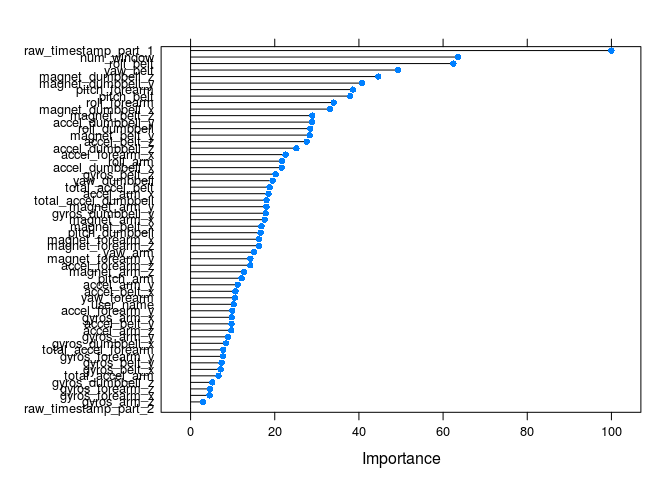

# Predicting the Quantified Self
Bastiaan Quast  
Monday, July 21, 2014  

## Abstract
We use the random forest method to estimate features for the Human Activity Recognition data set from Groupware. We that this method produces relevant results.


## Data
The data is taken from the [Human Activity Recognition](http://groupware.les.inf.puc-rio.br/har) programme at [Groupware](http://groupware.les.inf.puc-rio.br/).

We start the data loading procedure by specifying the data sources and destinations.

```r
training.file <- 'pml-training.csv'
test.file     <- 'pml-test.csv'
training.url  <- 'https://d396qusza40orc.cloudfront.net/predmachlearn/pml-training.csv'
test.url      <- 'https://d396qusza40orc.cloudfront.net/predmachlearn/pml-testing.csv'
```
We then execute the downloads.

```r
download.file(training.url, training.file)
download.file(test.url,     test.file)
```
In order to ensure all transformations are applied to both the trainig and test data sets equally, we employ the OOP method and create functions for every step. First we create a function to read data and set NAs and apply this to both datasets.

```r
read.pml       <- function(x) { read.csv(x, na.strings = c("", "NA", "#DIV/0!") ) }
training       <- read.pml(training.file)
test           <- read.pml(test.file)
training       <- training[,-c(1,5,6)]
test           <- test[,-c(1,5,6)]
```


```r
library(caret)
trainingIndex  <- createDataPartition(training$classe, p=.50, list=FALSE)
training.train <- training[ trainingIndex,]
training.test  <- training[-trainingIndex,]
```

Next we create a function to remove entire NA columns, and apply it to both data frames. Lastly we create a function that removes any variables with missing NAs and apply this to the training set.

```r
rm.na.cols     <- function(x) { x[ , colSums( is.na(x) ) < nrow(x) ] }
training.train <- rm.na.cols(training.train)
training.test  <- rm.na.cols(training.test)
complete       <- function(x) {x[,sapply(x, function(y) !any(is.na(y)))] }
incompl        <- function(x) {names( x[,sapply(x, function(y) any(is.na(y)))] ) }
trtr.na.var    <- incompl(training.train)
trts.na.var    <- incompl(training.test)
training.train <- complete(training.train)
training.test  <- complete(training.test)
```

## Method
We use the **Random Forests** method, which applies **bagging** to **tree learners**.

The **Random Forests** method is described by Leo Breiman in [Random Forests](http://dx.doi.org/10.1023%2FA%3A1010933404324).

The **B**ootstap **Agg**regat**ing** (bagging) method is described in [Technical Report No. 421: Bagging Predictors](http://dx.doi.org/10.1007%2FBF00058655) by Leo Breiman.

```r
library(randomForest)
random.forest <- train(training.train[,-57],
                       training.train$classe,
                       tuneGrid=data.frame(mtry=3),
                       trControl=trainControl(method="none")
                       )
```


## Results
Some statistics on the results

```r
summary(random.forest)
```

```
##                 Length Class      Mode     
## call                4  -none-     call     
## type                1  -none-     character
## predicted        9812  factor     numeric  
## err.rate         3000  -none-     numeric  
## confusion          30  -none-     numeric  
## votes           49060  matrix     numeric  
## oob.times        9812  -none-     numeric  
## classes             5  -none-     character
## importance         56  -none-     numeric  
## importanceSD        0  -none-     NULL     
## localImportance     0  -none-     NULL     
## proximity           0  -none-     NULL     
## ntree               1  -none-     numeric  
## mtry                1  -none-     numeric  
## forest             14  -none-     list     
## y                9812  factor     numeric  
## test                0  -none-     NULL     
## inbag               0  -none-     NULL     
## xNames             56  -none-     character
## problemType         1  -none-     character
## tuneValue           1  data.frame list     
## obsLevels           5  -none-     character
```
We now compare the results from the predition with the actual data.

```r
confusionMatrix(predict(random.forest,
                        newdata=training.test[,-57]),
                training.test$classe
                )
```

```
## Confusion Matrix and Statistics
## 
##           Reference
## Prediction    A    B    C    D    E
##          A 2790    1    0    0    0
##          B    0 1896    9    0    0
##          C    0    1 1702   20    0
##          D    0    0    0 1588    1
##          E    0    0    0    0 1802
## 
## Overall Statistics
##                                         
##                Accuracy : 0.997         
##                  95% CI : (0.995, 0.998)
##     No Information Rate : 0.284         
##     P-Value [Acc > NIR] : <2e-16        
##                                         
##                   Kappa : 0.996         
##  Mcnemar's Test P-Value : NA            
## 
## Statistics by Class:
## 
##                      Class: A Class: B Class: C Class: D Class: E
## Sensitivity             1.000    0.999    0.995    0.988    0.999
## Specificity             1.000    0.999    0.997    1.000    1.000
## Pos Pred Value          1.000    0.995    0.988    0.999    1.000
## Neg Pred Value          1.000    1.000    0.999    0.998    1.000
## Prevalence              0.284    0.193    0.174    0.164    0.184
## Detection Rate          0.284    0.193    0.173    0.162    0.184
## Detection Prevalence    0.285    0.194    0.176    0.162    0.184
## Balanced Accuracy       1.000    0.999    0.996    0.994    1.000
```
The Kappa statistic of 0.994 reflects the out-of-sample error.


```r
plot( varImp(random.forest) )
```

 
